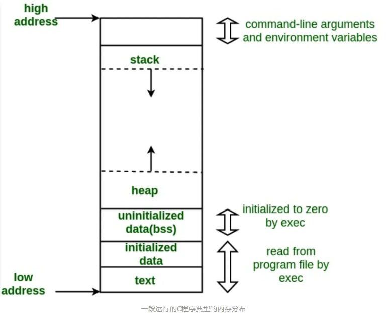

# C 程序的内存布局

一个典型的 C 程序内存布局应该有以下几个部分：

- 代码段/文本段（Text segment）
- 初始化数据段（Initialized data segment or Data segment）
- 未初始化数据段（Uninitialized data segment or bss）
- 栈（Stack）
- 堆（Heap）

1. 代码段（Text segment）
代码段（也成为文本段）是目标文件或者内存中的一个部分（段）。它包含着可执行指令。

作为内存区域，代码段可以放在堆或者栈的下面，以防止堆和栈溢出时覆盖它。

通常，文本段是可共享的，因此对于经常执行的程序（如文本编辑器、C编译器、shell等），只需要在内存中保存一个副本。此外，文本段通常是只读的，以防止程序意外地修改其指令。

2. 初始化数据段（Initialized data segment）
初始化的数据段，通常简称为数据段（Data segment）。数据段是程序虚拟地址空间的一部分，它包含由程序员初始化的全局变量和静态变量。

注意，数据段不是只读的，因为变量的值可以在运行时被更改。

该段可以被进一步分为（初始化的）只读区域和（初始化的）可读写区域。

例如，由C程序中定义的全局字符串char s[]=“hello world”和一句在 main 之外的C语句，如int debug=1（即全局变量global variable）将存储在初始化的读写区域中。而像全局变量 const char*string=“hello world” 这样的C语句，其字符串文本“hello world”存储在初始化只读区域，而字符指针变量字符串存储在初始化读写区域。

例：静态变量 （如static int i = 10）存储在数据段中，全局变量（如int i = 10）也存储在数据段中。

未初始化数据段（Uninitialized data segment or BSS）
未初始化的数据段，通常称为“bss”段，是早期汇编程序运算符“block started by symbol”的缩写。在程序开始执行之前，内核将该段中的数据初始化为算术0。

未初始化的数据（bss）从数据段（初始化的数据段）的末尾开始，包含所有初始化为零或在源代码中没有显式初始化的全局变量和静态变量。

例如，声明为 static int i 的静态变量 i 将包含在BSS段中。声明为 int j 的未初始化全局变量 j 将包含在BSS段中。

栈（Stack）
栈区域传统上与堆区域相邻，并朝相反的方向增长。当栈指针遇到堆指针时，可用内存耗尽。（随着现代的大地址空间和虚拟内存技术的发展，它们可以被放置在几乎任何地方，但它们通常还是朝相反的方向发展。）

栈区域包含程序栈，一种通常位于内存的较高部分的后进先出（LIFO）的数据结构。在标准的PC x86计算机体系结构上，它向地址零方向增长。在其他一些体系结构上，它向相反的方向增长。“栈指针”寄存器跟踪栈的顶部。每次将值置入栈（push）时都会对其进行调整。函数调用时置入（push）栈的数值集合（set of values）称为“栈帧”（stack frame）。栈帧至少包含一个返回地址。

栈用来存储自动变量（automatic variables），以及每次调用函数时需要保存的信息。每次调用函数时，要返回的地址和调用方环境的某些信息（如某些计算机寄存器）都保存在栈中。然后，新调用的函数在栈上为其自动变量和临时变量分配空间。这就是C中递归函数的工作原理。每次递归函数调用自身时，都会使用一个新的栈帧（stack frame），因此不同函数调用间的实例的变量并不会相互影响。

堆（Heap）
动态分配的内存就在堆区。

堆区域从BSS段的末尾开始向高地址方向生长。堆区域由malloc、realloc和free管理，malloc和free可以使用brk和sbrk系统调用来调整其大小。堆区域内容被进程中的所有共享库和动态加载的模块共享。

例子
size命令可以统计text，data，和bss段的大小，单位为bytes。

我们编译下面这个简单的例子，并查看其目标文件：
#include <stdio.h> 
  
int main(void) 
{ 
    return 0; 
} 

让我们在上面的程序中加入一个全局变量。接着我们看下bss段大小的变化（标红）：
#include <stdio.h> 
  
int global; /*未初始化的变量存贮在bss段*/
  
int main(void) 
{ 
    return 0; 
} 

让我们加一个未初始化的静态变量（static variable）：
#include <stdio.h> 
  
int global; /* Uninitialized variable stored in bss*/
  
int main(void) 
{ 
    static int i; /* Uninitialized static variable stored in bss */
    return 0; 
} 

让我们初始化静态变量。这样会使得静态变量被存贮在数据段（data segment）：
#include <stdio.h> 
  
int global; /* Uninitialized variable stored in bss*/
  
int main(void) 
{ 
    static int i = 100; /* Initialized static variable stored in DS*/
    return 0; 
} 

让我们初始化全局变量。同样，该变量将会被存到数据段：
#include <stdio.h> 
  
int global = 10; /* initialized global variable stored in DS*/
  
int main(void) 
{ 
    static int i = 100; /* Initialized static variable stored in DS*/
    return 0; 
} 

参考

作者：雨幻逐光
链接：https://www.jianshu.com/p/68200c2af788
来源：简书
著作权归作者所有。商业转载请联系作者获得授权，非商业转载请注明出处。
