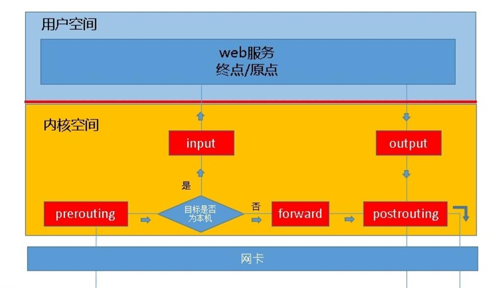
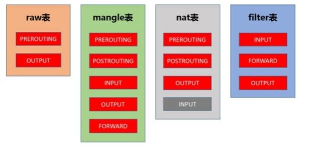
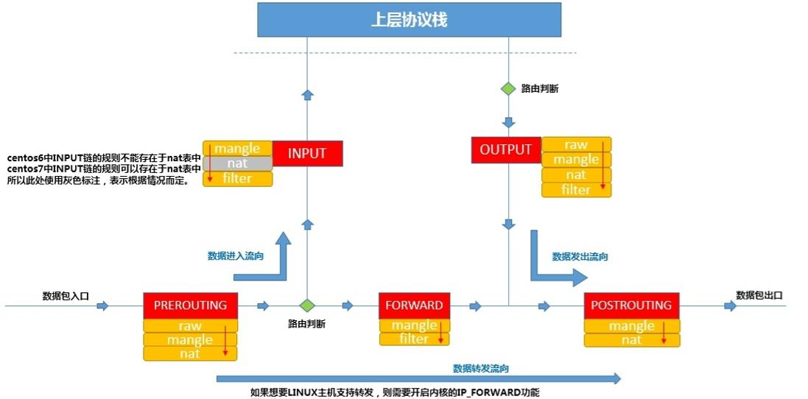

# iptables 详解

netfilter/iptables 组成 linux 平台下的包过滤防火墙。netfilter 位于内核空间中，是 linux 操作系统核心层内部的一个数据包处理模块，iptables 是用于在用户空间对内核空间的 netfilter 进行操作的命令行工具。

netfilter/iptables 能够实现如下功能：

- 数据包过滤，即防火墙。

- 数据包重定向，即转发。

- 网络地址转换，即 NAT。

## 1. 基本概念

### 1.1 iptables 工作依据

iptables 是按照规则（rules）来办事的，规则存储在内核空间的数据包过滤表中，这些规则分别指定了源地址、目的地址，传输协议（TCP、UDP、ICMP）和服务类型（HTTP、FTP）等。当数据包与规则匹配时，iptables 就根据规则所定义的方法来处理这些数据包，比如放行（ACCEPT）、拒绝（REJECT）、 丢弃（DROP）等。

总结：

- 工作依据是规则。

- 规则存在表中。

- 规则指定了什么？源地址或目的地址或传输协议的类型。

- 如果数据包备匹配到，按照规则指定的动作去执行。

### 1.2 iptables 中链的概念

举例说明，当客户端访问服务器端的 web 服务时，客户端的请求报文会通过内核协议栈传输到用户空间的 web 服务，所以，要想让 netfilter 起到作用，我们就需要在内核中设置“关口”，所以进出的数据报文都要通过这些关口，于是就出现了 INPUT 和 OUTPUT 关口，在 iptables 中叫做**链**。

如果客户端发到本机的报文中包含的服务器地址并不是本机，而是其他服务器，此时本机就应该进行转发，这个转发就是本机内核所支持的 IP_FORWARD 功能，此时我们的主机类似于路由器功能，所以我们会看到在 iptables 中，应该还有**路由前**、**转发**、**路由后**，也就是 PREROUTING、FORWARD、POSTROUTING，这就是我们说到的 5 链。

 
根据上图，我们可以知道报文的流向：

- 到本机某进程的报文：PREROUTING -> INPUT。

- 由本机转发的报文：PREROUTING -> FORWARD -> POSTROUTING。

- 由本机的某进程发出报文（通常为响应报文）：OUTPUT -> POSTROUTING。

### 1.3 iptables 中表的概念

我们可以把不同的**规则链**组合成能够完成某一特定功能集合，而这个集合就称为表，iptables 中共有 5 张表：

- filter: 过滤功能，确定是否放行该数据包，属于真正防火墙，内核模块：iptables_filter。

- nat: 网络地址转换功能，修改数据包中的源、目标IP地址或端口，内核模块：iptable_nat。

- mangle: 对数据包进行重新封装功能，为数据包设置标记，内核模块：iptable_mangle。

- raw: 确定是否对数据包进行跟踪，内核模块：iptables_raw。
　　

### 1.4 iptables 中表链之间的关系

我们是以表为操作入口的，只要在相应的表中的规则链上添加规则即可实现某一功能。表包括的规则链如下：

- filter：INPUT、FORWARD、OUTPUT。

- nat：PREROUTING、OUTPUT、POSTROUTING、INPUT。

- mangle：PREROUTING、INPUT、FORWARD、OUTPUT、POSTROUTING。

- raw：PREROUTING、OUTPUT。

### 1.5 iptables 中表的优先级

raw - mangle - nat - filter。

