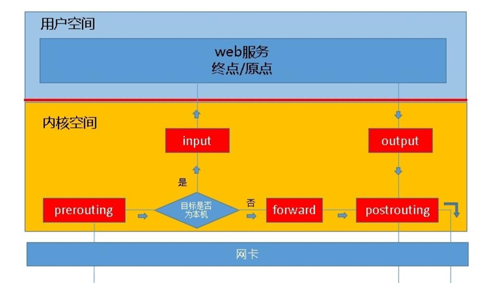
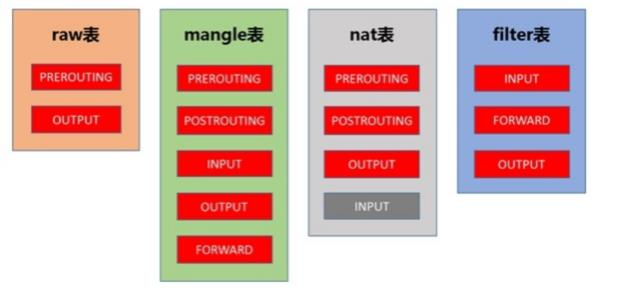
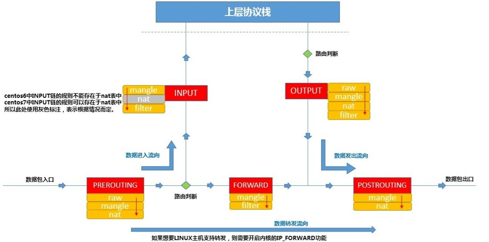

# iptables 详解

netfilter/iptables 组成 linux 平台下的包过滤防火墙。netfilter 位于内核空间中，是 linux 操作系统核心层内部的一个数据包处理模块，iptables 是用于在用户空间对内核空间的 netfilter 进行操作的命令行工具。

netfilter/iptables 能够实现如下功能：

- 数据包过滤，即防火墙。

- 数据包重定向，即转发。

- 网络地址转换，即 NAT。

## 1. 基本概念

### 1.1 iptables 工作依据

iptables 是按照规则（rules）来办事的，规则存储在内核空间的数据包过滤表中，这些规则分别指定了源地址、目的地址，传输协议（TCP、UDP、ICMP）和服务类型（HTTP、FTP）等。当数据包与规则匹配时，iptables 就根据规则所定义的方法来处理这些数据包，比如放行（ACCEPT）、拒绝（REJECT）、 丢弃（DROP）等。

总结：

- 工作依据是规则。

- 规则存在表中。

- 规则指定了什么？源地址或目的地址或传输协议的类型。

- 如果数据包备匹配到，按照规则指定的动作去执行。

### 1.2 iptables 中链的概念

举例说明，当客户端访问服务器端的 web 服务时，客户端的请求报文会通过内核协议栈传输到用户空间的 web 服务，所以，要想让 netfilter 起到作用，我们就需要在内核中设置“关口”，所以进出的数据报文都要通过这些关口，于是就出现了 INPUT 和 OUTPUT 关口，在 iptables 中叫做**链**。

如果客户端发到本机的报文中包含的服务器地址并不是本机，而是其他服务器，此时本机就应该进行转发，这个转发就是本机内核所支持的 IP_FORWARD 功能，此时我们的主机类似于路由器功能，所以我们会看到在 iptables 中，应该还有**路由前**、**转发**、**路由后**，也就是 PREROUTING、FORWARD、POSTROUTING，这就是我们说到的 5 链。


 
根据上图，我们可以知道报文的流向：

- 到本机某进程的报文：PREROUTING -> INPUT。

- 由本机转发的报文：PREROUTING -> FORWARD -> POSTROUTING。

- 由本机的某进程发出报文（通常为响应报文）：OUTPUT -> POSTROUTING。

### 1.3 iptables 中表的概念

我们可以把不同的**规则链**组合成能够完成某一特定功能集合，而这个集合就称为表，iptables 中共有 5 张表：

- filter: 过滤功能，确定是否放行该数据包，属于真正防火墙，内核模块：iptables_filter。

- nat: 网络地址转换功能，修改数据包中的源、目标IP地址或端口，内核模块：iptable_nat。

- mangle: 对数据包进行重新封装功能，为数据包设置标记，内核模块：iptable_mangle。

- raw: 确定是否对数据包进行跟踪，内核模块：iptables_raw。
　　

### 1.4 iptables 中表链之间的关系

我们是以表为操作入口的，只要在相应的表中的规则链上添加规则即可实现某一功能。表包括的规则链如下：

- filter：INPUT、FORWARD、OUTPUT。

- nat：PREROUTING、OUTPUT、POSTROUTING、INPUT。

- mangle：PREROUTING、INPUT、FORWARD、OUTPUT、POSTROUTING。

- raw：PREROUTING、OUTPUT。



### 1.5 iptables 中表的优先级

raw - mangle - nat - filter。



## 2. 用法示例

**格式：**

```shell
iptables [-t 表名] 选项 [链名] [条件] [-j 控制类型]
```

**参数：**

-P 设置默认策略：iptables -P INPUT (DROP|ACCEPT)。

-F 清空规则链。

-L 查看规则链。

-A 在规则链的末尾加入新规则。

-I num 在规则链的头部加入新规则。

-D num 删除某一条规则。

-s 匹配来源地址 IP/MASK，加叹号 "!" 表示除这个IP外。

-d 匹配目标地址。

-i 网卡名称，匹配从这块网卡流入的数据。

-o 网卡名称，匹配从这块网卡流出的数据。

-p 匹配协议，如tcp、udp、icmp。

--dport num 匹配目标端口号。

--sport num 匹配来源端口号。

### 2.1 查看已有规则

```shell
iptables -t filter -n -L
iptables -t filter -n -L INPUT

# 有时候用 save 看的更全面, 防止有些条件没有显示出来.
iptables-save
iptables-save -t filter
```

### 2.2 删除已有规则

在开始创建 iptables 规则之前，你也许需要删除已有规则。命令如下：

```shell
iptables -F
iptables –flush
```

### 2.3 设置链的默认策略

链的默认政策设置为 ACCEPT（接受），若要将INPUT、FORWARD、OUTPUT 链设置成 DROP（拒绝），命令如下：

```shell
iptables -t filter -P INPUT DROP
iptables -t filter -P FORWARD DROP
iptables -t filter -P OUTPUT DROP
```

当 INPUT 链和 OUTPUT 链都设置成 DROP 时，对于每一个防火墙规则，我们都应该定义两个规则。例如：一个传入另一个传出。在下面所有的例子中，由于我们已将 DROP 设置成 INPUT 链和 OUTPUT 链的默认策略，每种情况我们都将制定两条规则。当然，如果你相信你的内部用户，则可以省略上面的最后一行。例如：默认不丢弃所有出站的数据包。在这种情况下，对于每一个要求，你只需要对进站的数据包制定规则。

### 2.4 阻止指定 IP 地址

阻止来自 IP 地址 x.x.x.x 的所有包：

```shell
iptables -t filter -A INPUT -s "x.x.x.x" -j DROP
```

阻止来自 IP 地址 x.x.x.x eth0 tcp 的包：

```shell
iptables -t filter -A INPUT -i eth0 -p tcp -s "x.x.x.x" -j DROP
```

### 2.5 仅允许来自指定网络的 SSH 连接请求

仅允许来自 192.168.100.0/24 的用户的 ssh 连接请求：

```shell
iptables -A INPUT -i eth0 -p tcp -s 192.168.100.0/24 --dport 22 -m state --state NEW,ESTABLISHED -j ACCEPT
iptables -A OUTPUT -o eth0 -p tcp --sport 22 -m state --state ESTABLISHED -j ACCEPT
```

### 2.6 允许 http 和 https 的连接请求

允许所有来自 web - http 的连接请求：

```shell
iptables -A INPUT -i eth0 -p tcp --dport 80 -m state --state NEW,ESTABLISHED -j ACCEPT
iptables -A OUTPUT -o eth0 -p tcp --sport 80 -m state --state ESTABLISHED -j ACCEPT
```

允许所有来自 web - https 的连接请求：

```shell
iptables -A INPUT -i eth0 -p tcp --dport 443 -m state --state NEW,ESTABLISHED -j ACCEPT
iptables -A OUTPUT -o eth0 -p tcp --sport 443 -m state --state ESTABLISHED -j ACCEPT
```

### 2.7 使用 multiport 将多个规则结合在一起

允许多个端口从外界连入，除了为每个端口都写一条独立的规则外，我们可以用 multiport 将其组合成一条规则。如下所示：

```shell
iptables -A INPUT -i eth0 -p tcp -m multiport --dports 22,80,443 -m state --state NEW,ESTABLISHED -j ACCEPT
iptables -A OUTPUT -o eth0 -p tcp -m multiport --sports 22,80,443 -m state --state ESTABLISHED -j ACCEPT
```

### 2.8 允许从本地发起的 SSH 请求

```shell
iptables -A OUTPUT -o eth0 -p tcp --dport 22 -m state --state NEW,ESTABLISHED -j ACCEPT
iptables -A INPUT -i eth0 -p tcp --sport 22 -m state --state ESTABLISHED -j ACCEPT
```

请注意，这与允许 ssh 连入的规则略有不同。本例在 OUTPUT 链上，我们允许 NEW 和 ESTABLISHED 状态。在 INPUT 链上，我们只允许 ESTABLISHED 状态。ssh 连入的规则与之相反。

### 2.9 仅允许从本地发起到一个指定的网络域的 SSH 请求

```shell
iptables -A OUTPUT -o eth0 -p tcp -d 192.168.100.0/24 --dport 22 -m state --state NEW,ESTABLISHED -j ACCEPT
iptables -A INPUT -i eth0 -p tcp --sport 22 -m state --state ESTABLISHED -j ACCEPT
```

### 2.10 允许从本地发起的 HTTPS 连接请求

下面的规则允许输出安全的网络流量。如果你想允许用户访问互联网，这是非常有必要的。在服务器上，这些规则能让你使用 wget 从外部下载一些文件。

```shell
iptables -A OUTPUT -o eth0 -p tcp --dport 443 -m state --state NEW,ESTABLISHED -j ACCEPT
iptables -A INPUT -i eth0 -p tcp --sport 443 -m state --state ESTABLISHED -j ACCEPT
```

注：对于 HTTP web 流量的外联请求，只需要将上述命令中的端口从 443 改成 80 即可。

### 2.11 负载平衡传入的网络流量

使用 iptables 可以实现传入 web 流量的负载均衡。

例：使用 iptables nth 将 HTTPS 流量负载平衡至三个不同的 ip 地址：

```shell
iptables -A PREROUTING -i eth0 -p tcp --dport 443 -m state --state NEW -m nth --counter 0 --every 3 --packet 0 -j DNAT --to-destination 192.168.1.101:443
iptables -A PREROUTING -i eth0 -p tcp --dport 443 -m state --state NEW -m nth --counter 0 --every 3 --packet 1 -j DNAT --to-destination 192.168.1.102:443
iptables -A PREROUTING -i eth0 -p tcp --dport 443 -m state --state NEW -m nth --counter 0 --every 3 --packet 2 -j DNAT --to-destination 192.168.1.103:443
```

### 2.12 允许外部主机 ping 内部主机

```shell
iptables -A INPUT -p icmp --icmp-type echo-request -j ACCEPT
iptables -A OUTPUT -p icmp --icmp-type echo-reply -j ACCEPT
```

### 2.13 允许内部主机 ping 外部主机

```shell
iptables -A OUTPUT -p icmp --icmp-type echo-request -j ACCEPT
iptables -A INPUT -p icmp --icmp-type echo-reply -j ACCEPT
```

### 2.14 允许回环访问

在服务器上允许 127.0.0.1 回环访问：

```shell
iptables -A INPUT -i lo -j ACCEPT
iptables -A OUTPUT -o lo -j ACCEPT
```

### 2.15 允许内部网络与外部网络的通信

防火墙服务器上的其中一个网卡连接到外部，另一个网卡连接到内部服务器，使用以下规则允许内部网络与外部网络的通信。此例中，eth1 连接到外部网络，eth0 连接到内部网络。

```shell
iptables -A FORWARD -i eth0 -o eth1 -j ACCEPT
```

### 2.16 允许出站的 DNS 连接

```shell
iptables -A OUTPUT -p udp -o eth0 --dport 53 -j ACCEPT
iptables -A INPUT -p udp -i eth0 --sport 53 -j ACCEPT
```

### 2.17 防止 DoS 攻击

```shell
iptables -A INPUT -p tcp --dport 80 -m limit --limit 25/minute --limit-burst 100 -j ACCEPT
```

上述例子中：-m limit，启用limit扩展；--limit 25/minute，允许最多每分钟 25 个连接；--limit-burst 100，只有当连接达到 limit-burst 水平（此例为 100）时才启用上述 limit/minute 限制。

### 2.18 端口转发

将来自 422 端口的流量全部转到 22 端口。这意味着我们既能通过 422 端口又能通过 22 端口进行 ssh 连接。

```shell
iptables -t nat -A PREROUTING -p tcp -d 192.168.102.37 --dport 422 -j DNAT --to 192.168.102.37:22
```

除此之外，还需要允许连接到 422 端口的请求。

```shell
iptables -A INPUT -i eth0 -p tcp --dport 422 -m state --state NEW,ESTABLISHED -j ACCEPT
iptables -A OUTPUT -o eth0 -p tcp --sport 422 -m state --state ESTABLISHED -j ACCEPT
```

### 2.19 TRACE

我们以调试 ipv4 的 ICMP 报文为例，进行日志的采集。因此在机器上添加一下规则：

```shell
iptables -t raw -A PREROUTING -p icmp -j TRACE
iptables -t raw -A OUTPUT -p icmp -j TRACE
```

**CentOS 6 系列：**

由于 iptables 的调试日志输出依赖于内核模块，这些内核模块并不是开机就加载的，因此我们需要手动加载，在 CentOS 6 系列上 iptables 日志输出依赖于 ipt_LOG 模块，所以手动加载该模块。

```shell
[root@centos6:~]$ modprobe ipt_LOG
```

加载完后，我们可以通过以下命令确认下是否成功，如果为 NULL，那么就失败了。

```shell
[root@centos6:~]$ sysctl net.netfilter.nf_log.2
net.netfilter.nf_log.2 = ipt_LOG
```

**CentOS 7 系列：**

```shell
[root@centos7:~]$  modprobe nf_log_ipv4

[root@centos7:~]$  sysctl net.netfilter.nf_log.2
net.netfilter.nf_log.2 = nf_log_ipv4
```

**注：**

需要设置 rsyslogd 以便记录 kernel messages：

```shell
[root@host:~]$ cat /etc/rsyslog.conf | grep -e "^kern"
kern.*                /var/log/kern.log
```

重启 rsyslogd：

```shell
[root@host:~]$ systemctl restart rsyslog
```

### 2.20 LOG

iptables 独立日志：

```shell
# 添加如下内容.
[root@host:~]$ vi /etc/rsyslog.conf
kern.warning                                            /var/log/iptables.log
```

同上例，需要开启日志模块以及重启 rsyslog。

例：iptables 日志规则：

```shell
iptables -t mangle -I PREROUTING -p tcp -j LOG --log-level 4 --log-prefix "[mangle, PREROUTING]"
```
